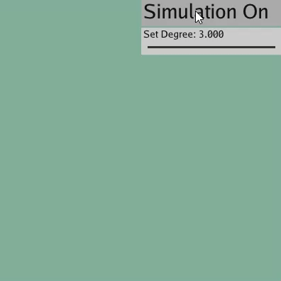

# 【作业二】 贝塞尔曲线简易可视化系统

## 背景简介

贝塞尔曲线是计算机图形学中很经典的参数曲线，这个系统实现了贝塞尔曲线基类，用户可以通过滑动条设置阶数，系统会随机生成对应的控制点并计算与绘制贝塞尔曲线。

## 成功效果展示

默认的阶数为 3，点击 Simulation On 按钮会随机生成 4 个控制点，然后进行三阶贝塞尔曲线的计算与绘制。

下图展示了一次完整的计算与绘制过程，其中橙色的点为控制点，蓝色的线段连接 x 轴正方向上相邻的控制点，白色的曲线为系统得出的贝塞尔曲线：



鼠标可以调整 Set Degree 滑动条设置阶数，由于滑动条默认是浮点类型，点击 Simulation On 以后会自动将滑动条的值调整为一个整型的阶数，系统会根据阶数随机生成对应的控制点并开始计算。

下图展示了调整不同阶数并进行计算绘制的过程：


## 整体结构

```
- BezierBase.py 贝塞尔曲线基类，包含生成控制点和计算贝塞尔曲线等方法
- main.py 定义了 GUI，捕获用户鼠标事件生成对应的贝塞尔曲线类
```

## 运行方式

`python3 main.py`