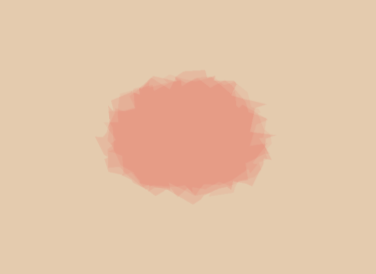

# 【作业五】 ShaderToy 的简单尝试

## 背景简介

首先找了一个非常简单但是看起来很炫的 ShaderToy Demo (来自 https://www.shadertoy.com/view/XsXXDn) 移植到了 Taichi 中实现

然后找了一个非常可爱的 ShaderToy Demo (来自 https://www.shadertoy.com/view/4t2SRh) 学习了一下它的实现原理，并且基于它的实现方式添加了垂直下落的雨滴

还找到了一个简单但是非常好看的水彩 Shader (来自 https://www.shadertoy.com/view/lt2BRm) ，发现它是参考博客 https://paytonturnage.com/writing/water-color/ 简化实现的，原博客用了 polygons 模拟水彩的形状，这个 demo 用的 perlin noise 生成的水彩形状。

学习了一下原博客，把 ShaderToy 上的水彩形状生成变成了基于多边形生成的方法，用了扫描线算法，但是由于时间关系没有对边界和透明度做更多的处理，生成多边形形状也做了简化处理，只是有了一个基本的雏形

## 成功效果展示




## 整体结构

```
- testShader.py 参考 https://www.shadertoy.com/view/XsXXDn
- umbrellaShader.py 参考 https://www.shadertoy.com/view/4t2SRh
- waterColor.py 参考 https://www.shadertoy.com/view/lt2BRm
- waterColorBaseStructure.py 水彩多边形生成计算类
- waterColorMain.py 水彩绘制主函数
- handy_shader_functions.py 来自官方的工具类
```

## 运行方式

`python3 testShader.py`

`python3 umbrellaShader.py`

`python3 waterColor.py`