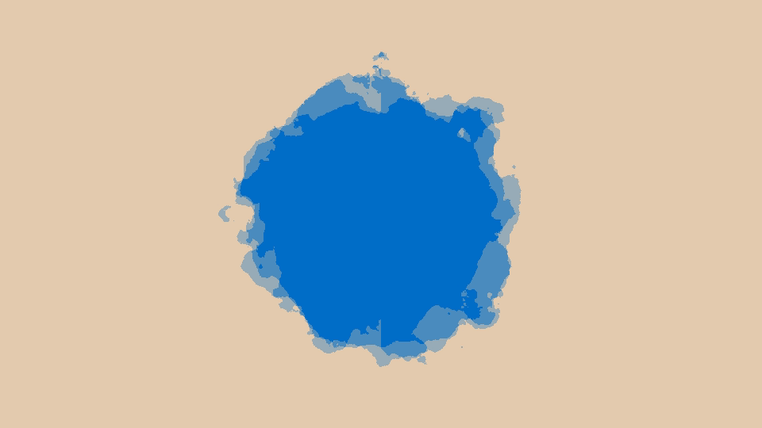

# 【作业五】 ShaderToy 的简单尝试

## 背景简介

首先找了一个非常简单但是看起来很炫的 ShaderToy Demo (来自 https://www.shadertoy.com/view/XsXXDn) 移植到了 Taichi 中实现

然后找了一个非常可爱的 ShaderToy Demo (来自 https://www.shadertoy.com/view/4t2SRh) 学习了一下它的实现原理，并且基于它的实现方式添加了垂直下落的雨滴

还找到了一个简单但是非常好看的水彩 Shader (来自 https://www.shadertoy.com/view/lt2BRm) ，发现它是参考博客 https://paytonturnage.com/writing/water-color/ 简化实现的，原博客用了 polygons 模拟水彩效果，这个 Demo 用的 perlin noise，打算趁着周末摸鱼学习一下原文进行改进~

不得不说 ShaderToy 上的大神都好强，仅仅纯 2D 的美丽的效果都已经让我眼花缭乱了，沉迷其中无法自拔，慢慢学习 ing

## 成功效果展示




## 整体结构

```
- testShader.py 参考 https://www.shadertoy.com/view/XsXXDn
- umbrellaShader.py 参考 https://www.shadertoy.com/view/4t2SRh
- waterColor.py 参考 https://www.shadertoy.com/view/lt2BRm
- handy_shader_functions.py 来自官方的工具类
```

## 运行方式

`python3 testShader.py`

`python3 umbrellaShader.py`

`python3 waterColor.py`