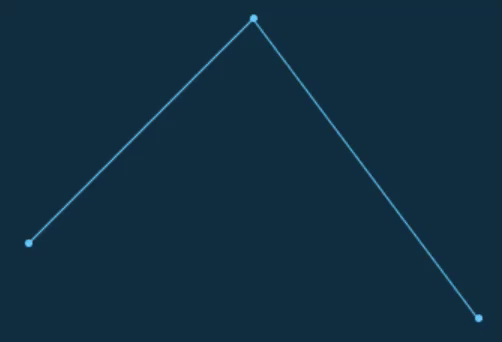
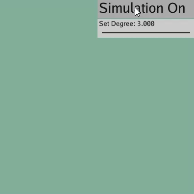
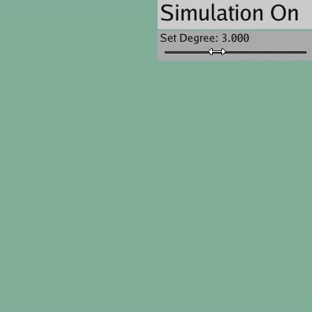

# CG Demos Using TaiChi

## Julia Set

https://en.wikipedia.org/wiki/Julia_set

## N-Body Problem

http://www.scholarpedia.org/article/N-body_simulations_(gravitational)

https://zh.wikipedia.org/zh-hans/N%E4%BD%93%E9%97%AE%E9%A2%98

http://users.wfu.edu/choss/CUDA/docs/Lecture%2012.pdf

https://yangwc.com/2019/06/20/NbodySimulation/

## N-Body Problem with Mouse

## Galaxy

## 2D Bezier Curve

## General Degree Bezier Curve With Button

